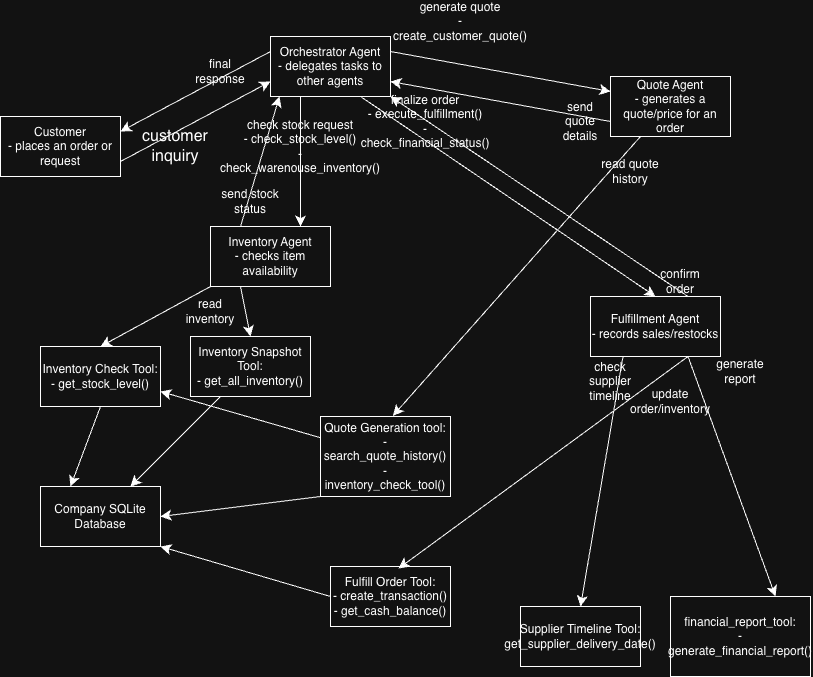

# Autonomous Multi-Agent Sales & Inventory Orchestration System

An event-driven multi-agent architecture built in Python to automate end-to-end sales operations, dynamic pricing, and inventory reconciliation from unstructured customer requests.



## Repository Structure & Modular Design

- `app.py`: Streamlit interactive dashboard providing a real-time UI to submit quote requests, inspect dynamic pricing, and monitor agent execution states.
- `orchestrator.py`: Core multi-agent execution engine managing state, prompt routing, tool calling, and transactional guardrails.
- `quotes.csv` & `quote_requests.csv`: Relational and historical datasets powering dynamic discount modeling and test evaluation batches.
- `evaluation_report.md`: Detailed performance metrics, error analyses, and edge-case benchmarking.

## Architecture Overview

The system orchestrates a team of specialized autonomous agents that coordinate state, execute tools, and validate transactional boundaries:

1. **Orchestrator Agent**: Ingests unstructured natural language requests, plans sequential execution paths, and delegates subtasks to specialized agents.
2. **Inventory Agent**: Queries real-time stock levels, manages transactional safety, and triggers automated restocking logic when inventory falls below threshold levels.
3. **Quoting Agent**: Analyzes historical transaction records (`quotes.csv`) to compute dynamic, volume-based tiered discounts.
4. **Order Fulfillment Agent**: Reconciles financial balances, commits sales transactions, and generates structured receipt payloads.
5. **Business Intelligence & Audit Agent**: Evaluates team performance against financial metrics, cash flow health, and transaction completion rates.

## Core Capabilities & Agentic Design

- **State & Memory Management**: Maintains cross-agent context using structured message passing to prevent context drift across multi-turn exchanges.
- **Dynamic Tool Calling**: Uses validated tool schemas wrapping SQLite and Pandas for deterministic data operations.
- **Evaluation & Guardrails**: Evaluates intermediate agent outputs to detect execution errors, illogical quotes, and inventory over-allocation before finalizing transactions.

## Performance & Evaluation

The system was evaluated against edge-case customer scenarios (including partial fulfillment, sudden stock depletion, and custom bulk discount negotiations). 

- **Full benchmark report**: See [`evaluation_report.md`](evaluation_report.md)
- **Raw execution traces**: See [`test_results.csv`](test_results.csv)

## Quickstart

### 1. Installation
```bash
git clone [https://github.com/CV145/autonomous-agent-workflow.git](https://github.com/CV145/autonomous-agent-workflow.git)
cd autonomous-agent-workflow
pip install -r requirements.txt
```

### 2. Run the interactive streamlit app
streamlit run app.py

### 3. Run batch orchestration
python orchestrator.py


### Note
An OPEN AI API Key in a .env file is needed to make the AI calls