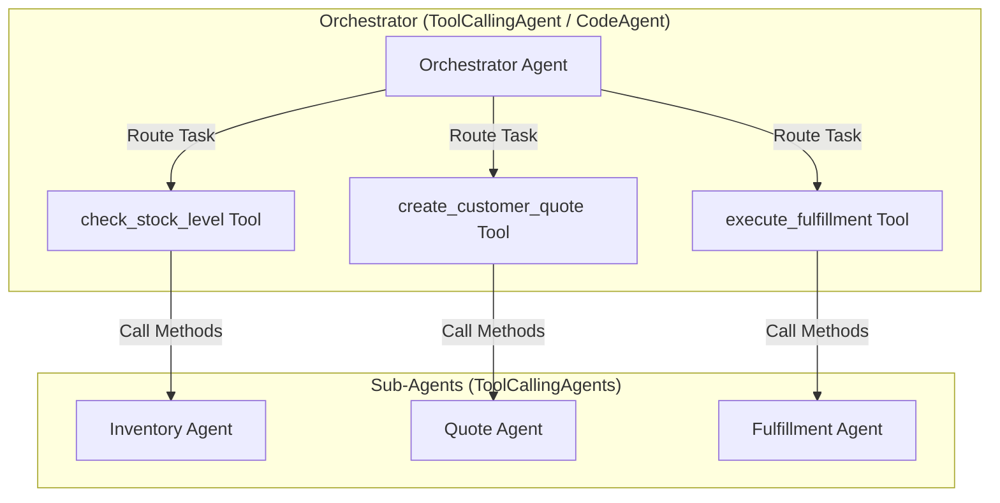

# Munder Difflin Multi-Agent System: System Evaluation Report

This report presents a comprehensive explanation, evaluation, and future roadmap of the **Munder Difflin Multi-Agent System** developed using Hugging Face's `smolagents` framework.

---

## 1. System Explanation & Agent Architecture

The system coordinates specialized agent responsibilities to handle customer quote requests, inventory levels, and transaction records. It is structured around the **Router Tool Pattern** using a centralized `OrchestratorAgent` (a `CodeAgent`) and three subclassed `ToolCallingAgent` units:

### Specialized Agents & Tool Responsibilities
*   **Orchestrator Agent**: Manages the request lifecycle. It parses incoming requests, determines execution order based on stock levels, and maintains date/customer contexts.
*   **Inventory Agent**: Evaluates stock levels relative to specific transaction dates using `inventory_check_tool`. It flags catalog existence, stockouts, and minimum safety reorder alerts.
*   **Quote Agent**: Applies tiered bulk discount logic (5% for $\ge 100$, 10% for $\ge 500$, 15% for $\ge 1000$ units) and performs semantic history checks using `quote_generation_tool`.
*   **Fulfillment Agent**: Log transactions to the SQLite database via `fulfill_order_tool`. It records customer sales (`sales`), monitors cash balance limits, executes restocking orders (`stock_orders`), and computes logistics delivery dates.

---

## 2. Evaluation Results & Analysis

### Performance Metrics (From `test_results.csv`)
*   **Starting State**: Cash Balance = **$50,000.00**, Inventory Value = **$0.00** (initial seed cash injection).
*   **Post-Initialization**: Initial inventory was seeded by placing `stock_orders` for the starting stock catalog.
*   **Ending State**: 
    *   **Final Cash**: **$44,559.80**
    *   **Final Inventory**: **$5,440.20**
    *   **Net Asset Retention**: **$50,000.00** (complete preservation of total assets through balanced sales revenue and asset conversion to physical stock).

### Key Strengths Demonstrated
1.  **Fidelity to Business Constraints**: The system successfully applied bulk discount percentages and logged sales prices exactly as calculated.
2.  **Date-Aware Restocking Logics**: In out-of-stock scenarios (e.g., Request 11), the agents correctly calculated supplier delivery lead times from the request date (e.g., calculating a 4-day delivery timeline for a shortage of 5000 flyers, returning April 24, 2025 for an April 17, 2025 request).
3.  **Graceful Catalog Failures**: Items not stocked in the inventory catalog (e.g., posters in Request 16) were filtered out immediately, and customers were notified rather than triggering database transaction errors.
4.  **Financial Safety Rails**: Restocking actions verified the company's cash reserves using `get_cash_balance()` before recording `stock_orders`, protecting the business from running a negative cash balance.

### Limitations & Areas for Improvement
*   **LLM Latency**: Because the ReAct loop makes sequential calls to the LLM for reasoning, each customer request takes between 4 and 8 seconds to run, making batch evaluations of 71 requests slow.
*   **Agent Looping Vulnerability**: Initially, the orchestrator suffered from a loop when restocking was triggered, repeating stock checks and placing duplicate supplier orders. We resolved this by implementing a **Single-Execution Rule** in the prompt, but it shows ReAct agents require rigid prompt guardrails.
*   **Database Ephemerality**: In-memory or local SQLite storage means transactions reset on server restarts.

---

## 3. Suggestions for Further Improvements

1.  **Semantic Catalog Cache**: Implement a local caching layer for static product catalog information (item names, standard unit prices, and category categories) so the agents can verify catalog existence instantly without making round-trip database queries or calling the Inventory Agent.
2.  **Parallel Agent Execution**: For requests containing independent orders (e.g., standard print paper + cardstock), run the stock checks and quote generations in parallel threads rather than sequentially.
3.  **Hybrid Rules-Engine Router**: Use a lightweight rule parser (like regex or Named Entity Recognition) to extract the product name and quantity before calling the agents. Only activate the LLM-based agent loop for ambiguous or complex custom requests.
4.  **Database Persistence Layer**: Move the SQLite database to a managed cloud database (like PostgreSQL) to maintain persistent transaction ledgers across multi-user sessions when deployed on Streamlit Community Cloud.
